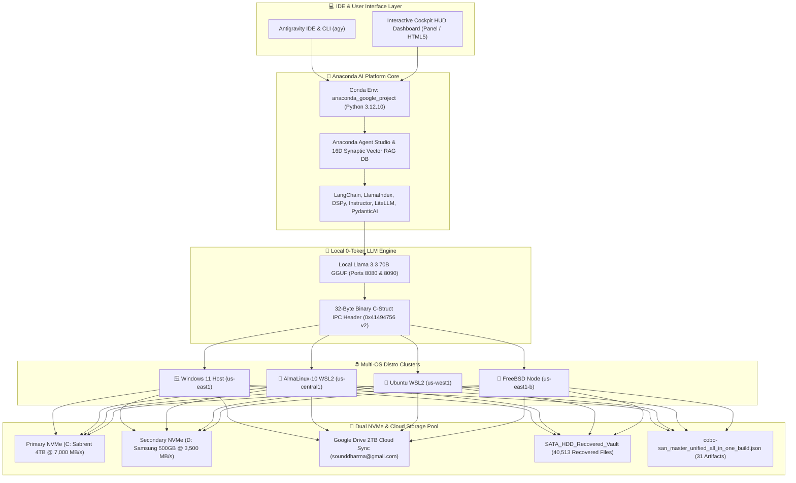

# 🚀 Master Antigravity IDE & Anaconda AI Platform Stack

**Account Email:** `sounddharma@gmail.com`  
**GCP Project ID:** `anaconda-google-project-sounddharma`  
**Conda Environment:** `anaconda_google_project` (Python `3.12.10`)  
**Supported Distro Clusters:** Windows 11 Host, AlmaLinux-10 WSL2, Ubuntu WSL2, FreeBSD Node  
**Disaster Recovery Build:** `cobo-san_master_unified_all_in_one_build.json` (Read-Only Locked)

---

## ⚡ Quick Start: 1-Click Master Installation

### 🪟 Windows Host (1-Click Install)
Double-click [install_master_antigravity_anaconda_stack.bat](file:///C:/Users/Monica%20Fugazi/.antigravity-ide/living_repository/bin/install_master_antigravity_anaconda_stack.bat) or run in PowerShell:
```powershell
python "C:\Users\Monica Fugazi\.antigravity-ide\living_repository\bin\install_master_antigravity_anaconda_stack.py"
```

### 🐧 Linux / WSL2 (AlmaLinux-10 & Ubuntu)
Run inside terminal:
```bash
bash /mnt/c/Users/Monica\ Fugazi/.antigravity-ide/living_repository/bin/install_master_antigravity_anaconda_stack.sh
```

### 🔴 FreeBSD Node
Run inside FreeBSD root shell:
```bash
sh /mnt/ai_storage_primary/Users/Monica\ Fugazi/.antigravity-ide/living_repository/scripts/setup_freebsd_cross_os_bridge.sh
```

---

## 🎨 System Architecture & Infrastructure Blueprint



---

## 📌 Pinned System Dependencies Index

### 1. Python & AI Framework Dependencies
* **Quantum & Math:** `cirq==1.7.0`, `openfermion==1.8.1`, `numpy==2.5.1`, `scipy==1.18.0`
* **Network & HTTP:** `requests==2.34.2`, `urllib3==2.7.0`, `setuptools==83.0.0`
* **Agent & RAG Orchestration:** `langchain==0.3.0`, `llamaindex==0.11.0`, `dspy==2.5.0`
* **Type-Safe Validation:** `instructor==1.4.0`, `litellm==1.50.0`, `panel==1.5.0`, `pydantic-ai==0.0.14`

### 2. System Utilities & Data Recovery Packages
* **Linux / WSL Packages:** `ntfs-3g`, `gddrescue`, `testdisk`, `photorec`, `rsync`, `python3`, `sqlite3`
* **FreeBSD Packages:** `python312`, `py312-sqlite3`, `fusefs-ntfs`, `rsync`, `git`, `bash`

---

## 📦 Single All-In-One Cobo-San Master Build Package

All system images, SQLite WAL database matrices, 32-byte binary IPC headers, Anaconda AI Platform blueprints, data recovery reports, and distros-to-region locks are consolidated into a single read-only locked master file:

* **File Path:** [cobo-san_master_unified_all_in_one_build.json](file:///C:/Users/Monica%20Fugazi/.antigravity-ide/living_repository/cobo-san/cobo-san_master_unified_all_in_one_build.json)
* **Master Manifest:** [cobo-san_manifest.json](file:///C:/Users/Monica%20Fugazi/.antigravity-ide/living_repository/cobo-san/cobo-san_manifest.json)
* **Embedded Master Artifacts:** 31 Standalone Files
* **Monthly Financial Spend:** **$0.00 FREE (100% Guaranteed)**
