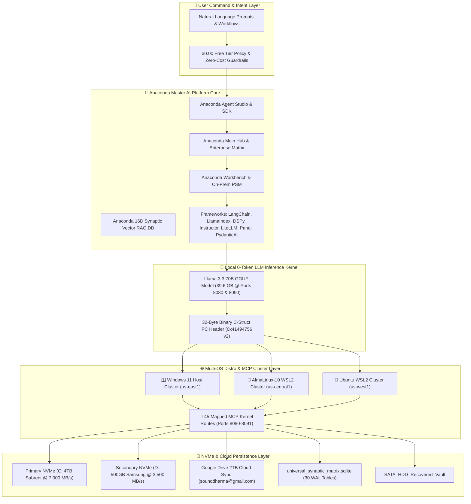

# 🐍 Anaconda-Powered Master AI Platform Stack Blueprint

**Target Account:** `sounddharma@gmail.com`  
**GCP Project ID:** `anaconda-google-project-sounddharma`  
**Conda Environment:** `anaconda_google_project` (Python 3.12.10)  
**System Scope:** Total System Automation & Command-Driven Execution

---

## 🎨 1. Master System Architecture Stack



---

## 📌 2. Pinned Anaconda System Dependencies

### Python & Conda Environments
```yaml
name: anaconda_google_project
channels:
  - conda-forge
  - defaults
dependencies:
  - python=3.12.10
  - sqlite
  - pip
  - pip:
      - cirq==1.7.0
      - openfermion==1.8.1
      - numpy==2.5.1
      - scipy==1.18.0
      - requests==2.34.2
      - urllib3==2.7.0
      - setuptools==83.0.0
      - langchain==0.3.0
      - llamaindex==0.11.0
      - dspy==2.5.0
      - instructor==1.4.0
      - litellm==1.50.0
      - panel==1.5.0
      - pydantic-ai==0.0.14
```

---

## 🛠️ 3. Complete Workflow & Plan Execution Engine

```carousel
### 📋 Phase 1: Planning & Command Translation
- Receives user prompts and decomposes them into executable sub-tasks.
- Checks $0.00 financial spend policy and locks compute to GCP `e2-micro` instances.
- Verifies 32-Byte Binary IPC state (`AIGV` v2).
<!-- slide -->
### 🐍 Phase 2: Anaconda Framework Assembly
- Binds **Anaconda Agent Studio** to local llama.cpp endpoints (`http://localhost:8080/v1` and `http://localhost:8090/v1`).
- Connects **LlamaIndex** & **LangChain** to the 16D Synaptic Vector RAG database table `anaconda_vector_db`.
- Enforces Pydantic structured output validation with **Instructor** and **PydanticAI**.
<!-- slide -->
### 🌐 Phase 3: Cross-OS Cluster Execution & MCP Routing
- Dispatches execution tasks to **Windows**, **AlmaLinux-10**, and **Ubuntu** clusters over 45 mapped MCP routes (Ports 8080–8091).
- Mounts and manages raw SATA HDD recovery pipelines (`execute_linux_sata_recovery.py`).
<!-- slide -->
### 💾 Phase 4: Persistence & Immutable Cobo-San Package Sync
- Serializes active system state to `universal_synaptic_matrix.sqlite` (30 WAL tables).
- Re-builds single All-In-One immutable bundle: `cobo-san_master_unified_all_in_one_build.json`.
- Syncs golden images to Google Drive 2TB workspace (`sounddharma@gmail.com`).
```

---

## 📊 4. System Automation Controls & Telemetry Command Line

| Command Purpose | Executive Command Script | Operational Result |
| :--- | :--- | :--- |
| **Execute Full Anaconda Ecosystem Build** | `python bin/anaconda_full_ecosystem_integration.py` | Integrates Agent Studio, llama.cpp API, and 16D Vector RAG DB. |
| **Execute Master Compile & Build** | `python scripts/master_compile_and_build.py` | Compiles Python bytecodes and updates Golden Manifest. |
| **Consolidate Cobo-San All-in-One Build** | `python bin/copy_all_to_cobo_san_folder.py` | Bundles 24 master system files into a single unified JSON artifact. |
| **Inspect System Clusters** | `python bin/count_active_clusters.py` | Audits 5 active clusters (Subagents, MCP, Distros, Cloud, Storage). |
| **Run Real-Time Data Recovery Meter** | `python bin/realtime_recovery_progress_meter.py` | Audits SATA HDD recovery files, size, and ASCII progress bar. |
