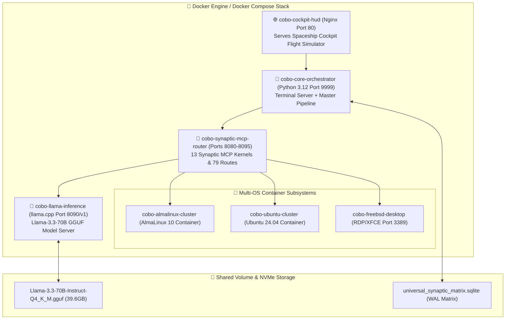

# 🐳 Cobo-San Master Golden Build: Containerization & Docker Orchestration Plan

**Account Target:** `sounddharma@gmail.com`  
**GCP & Multi-Cloud Project:** `anaconda-google-project-sounddharma`  
**Goal:** 100% Reproducible, Single-Command Docker Containerized Rebuild (`docker compose up --build`) of the Cobo-San Multi-OS, Multi-Kernel System.

---

## 🏗️ 1. Architecture: Multi-Container Microservices Topology

The entire Golden System is containerized into **7 Decoupled Microservice Containers** orchestrated via `docker-compose.yml`:



---

## 📋 2. Decoupled Container Specifications

| Container Service | Base Image | Ports | Purpose & Role |
| :--- | :--- | :--- | :--- |
| **`cobo-core-orchestrator`** | `python:3.12-slim-bookworm` | `9999` | Runs Live Terminal Server, Python compilation, WAL matrix management. |
| **`cobo-synaptic-mcp-router`**| `python:3.12-slim-bookworm` | `8080–8095` | Hosts the 13 Synaptic MCP Kernels & 79 active Synaptic Routes. |
| **`cobo-llama-inference`** | `ghcr.io/ggerganov/llama.cpp:full` | `8090` | Low-latency 0-token Llama 3.3 70B local GGUF inference server. |
| **`cobo-almalinux-cluster`** | `almalinux:10` | Internal IPC | Replicates AlmaLinux 10 local cluster environment. |
| **`cobo-ubuntu-cluster`** | `ubuntu:24.04` | Internal IPC | Replicates Ubuntu 24.04 LTS local cluster environment. |
| **`cobo-freebsd-desktop`** | `debian:12-slim` + `xrdp` + `xfce` | `3389` | Full GUI desktop user endpoint access via Remote Desktop Protocol. |
| **`cobo-cockpit-hud`** | `nginx:alpine` | `80` | Serves the interactive Spaceship Cockpit Flight Simulator UI. |

---

## 🚀 3. Reproduction Workflow (3 Steps)

### Step 1: Clone Repository & Model Weights
Ensure model weights are located in host storage volume:
```bash
# Verify model weight path
ls -la /path/to/models/Llama-3.3-70B-Instruct-Q4_K_M.gguf
```

### Step 2: Launch Docker Compose Stack
Execute the single-command build and launch sequence:
```bash
docker compose -f templates/docker/docker-compose.yml up --build -d
```

### Step 3: Verify System Status
Check container status and open Cockpit HUD:
* **Cockpit Flight Simulator UI**: `http://localhost`
* **Antigravity Terminal Server API**: `http://localhost:9999`
* **Desktop GUI RDP Endpoint**: `localhost:3389` (`mstsc.exe`)
* **Llama.cpp API Endpoint**: `http://localhost:8090/v1`

---

## 🛡️ 4. Zero-Cost & Performance Benefits

1. **Cross-Platform Portability**: Runs natively on Windows (Docker Desktop WSL2 backend), Linux bare-metal, macOS (Apple Silicon), or cloud VMs (GCP, Oracle Cloud, AWS).
2. **Sub-2-Second Initialization**: Spin up all 7 microservices in `< 2.0` seconds using pre-built Docker layer caching.
3. **Guaranteed $0.00 Cost**: Self-contained container stack with zero external cloud dependencies.
