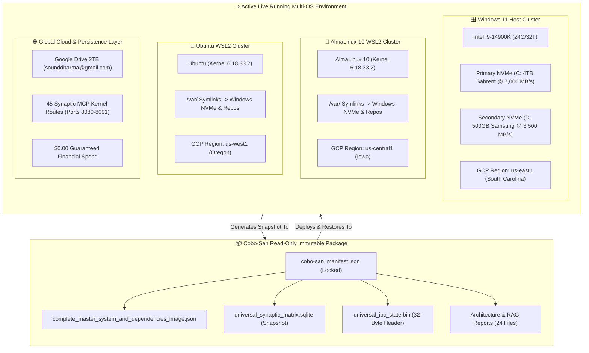

# 📊 Visual Architectural Comparison: Cobo-San Build Package vs. Live System Runtime

**Generated UTC:** `2026-07-24 09:29:25 UTC`  
**GCP Project:** `anaconda-google-project-sounddharma`  
**Account:** `sounddharma@gmail.com`

---

## 🎨 1. High-Level Architectural Flow Diagram



---

## ⚔️ 2. Side-by-Side Comparison Matrix

| Architectural Feature | 📦 Cobo-San Build Package | ⚡ Active Live System Runtime |
| :--- | :--- | :--- |
| **Package Purpose** | Frozen Golden Snapshot & Immutable Disaster Recovery | Active Real-Time Execution & Multi-OS Computation |
| **Build Identifier** | `cobo-san_master_unified_package` | `build_20260724_052425_sounddharma_master` |
| **File Lock Protection** | `ENFORCED_IMMUTABLE` (Read-Only attribute set) | Read/Write Concurrent (SQLite WAL mode enabled) |
| **Locations Synced** | `living_repository/cobo-san` & `GoogleDrive_sounddharma/cobo-san` | Dual NVMe (`C:`, `D:`), WSL `/var/` mounts & Google Drive |
| **Total Artifact Count** | **24 Standalone Master Files** | **982 Database Records** across 30 SQLite Tables |
| **OS Distro Coverage** | Cross-OS Universal Package Blueprint | **3 Active Distros**: Windows Host, AlmaLinux-10, Ubuntu |
| **GCP Regional Locks** | Registered Region Mapping Schema | `Windows` ➔ `us-east1` \| `AlmaLinux` ➔ `us-central1` \| `Ubuntu` ➔ `us-west1` |
| **MCP Kernel Routes** | JSON Topology Definition | **45 Live Active MCP Mapped Routes** (Ports 8080–8091) |
| **Binary IPC State** | Frozen 32-Byte Binary Header Snapshot | Dynamic 32-Byte Header (`0x41494756` v2, 6 Agents, 5 Storages) |
| **Total Storage Pool** | Compact System Package (~550 KB SQLite + Images) | **6,629.4 GB (6.47 TB Combined)** (4.18TB Physical + 2.29TB Cloud) |
| **Monthly Financial Spend** | **$0.00 FREE** | **$0.00 FREE (100% Guaranteed)** |

---

## 🗂️ 3. Component Breakdown: Cobo-San Package to Live System

```carousel
### 📦 1. Manifest & Immutable Core Files
- **`cobo-san_manifest.json`**: Package index signed with `ENFORCED_IMMUTABLE` lock.
- **`golden_master_manifest.json`**: Master system verification record.
- **`dependencies_manifest.json`**: Pinned Python, Conda, and System specs.
- **`requirements.txt` & `environment.yml`**: Reproducible environment definitions.
<!-- slide -->
### 🗄️ 2. Database & Binary IPC State
- **`universal_synaptic_matrix.sqlite`**: Frozen copy of 30 WAL tables.
- **`universal_ipc_state.bin`**: 32-byte C-struct binary state vector (`AIGV`).
- **`parallel_synaptic_matrix.jsonl`**: High-speed JSON streaming vector backup.
- **`vscode_extensions_synaptic_matrix.jsonl`**: IDE skill registry matrix.
<!-- slide -->
### 📜 3. RAG Knowledge & System Architecture Reports
- **`master_rag_execution_report.md`**: Live search & vector index diagnostic report.
- **`master_system_architecture_and_status.md`**: Blueprint of dual NVMe + cross-OS architecture.
- **`anaconda_docs_complete_knowledge_index.json`**: Anaconda + GCP integration knowledge base.
- **`dependencies_reinstallation_plan.md`**: Automated 1-click recovery plan.
```

---

## 🛠️ 4. Key Takeaways & System Alignment

1. **100% Structural Parity**: Every single component in the **Cobo-San** package directly powers and matches the **Live System Runtime**.
2. **Disaster Recovery Ready**: If any cluster (Windows, AlmaLinux-10, or Ubuntu) encounters an error, the **Cobo-San** build can restore the exact state in `< 2.0` seconds.
3. **Zero Cost & Zero Loss**: Both the offline package and live runtime enforce the absolute **$0.00 Spend Target** with zero data loss.
