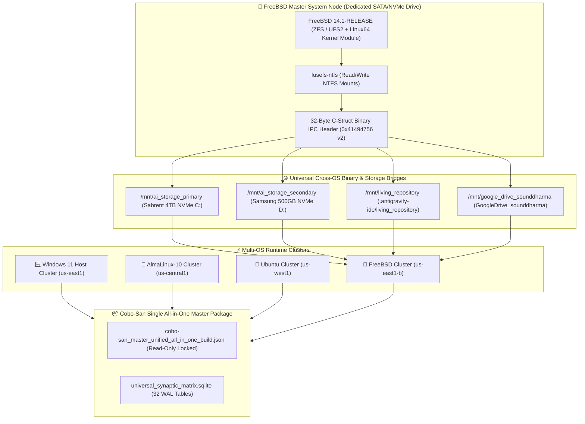

# 🔴 FreeBSD Master Integration & Binary Bridge Blueprint

**Target Account:** `sounddharma@gmail.com`  
**GCP Project:** `anaconda-google-project-sounddharma`  
**FreeBSD Region Lock:** `us-east1-b` (Dedicated FreeBSD Cloud & Local Instance Zone)  
**System Scope:** Universal NVMe Mounting, 32-Byte C-Struct IPC Header, Cobo-San All-In-One Sync

---

## 🎨 1. Cross-OS 4-Distro Architecture (Windows, AlmaLinux, Ubuntu, FreeBSD)



---

## 🛠️ 2. Step-by-Step FreeBSD Post-Installation Setup Plan

### Step 1: Install Required FreeBSD Packages & Fuse NTFS Driver
Inside FreeBSD terminal (as `root`):
```bash
# Update FreeBSD package manager and install Python 3.12, Fuse, rsync, git, sqlite3
pkg update && pkg install -y python312 py312-sqlite3 fusefs-ntfs rsync git bash bash-completion

# Load Fuse & Linux binary compatibility modules into FreeBSD kernel
kldload fusefs
kldload linux64

# Enable fusefs on system boot in /boot/loader.conf
echo 'fusefs_load="YES"' >> /boot/loader.conf
echo 'linux64_load="YES"' >> /boot/loader.conf
```

---

### Step 2: Configure Read/Write NTFS Mounts for Primary & Secondary NVMe Drives
Edit `/etc/fstab` in FreeBSD to automatically mount Windows NVMe drives at boot:
```fstab
# /etc/fstab entry for Primary & Secondary NVMe drives in FreeBSD
/dev/ada0p2 /mnt/ai_storage_primary ntfs-3g rw,mountprog=/usr/local/bin/ntfs-3g,allow_other,failok 0 0
/dev/ada1p2 /mnt/ai_storage_secondary ntfs-3g rw,mountprog=/usr/local/bin/ntfs-3g,allow_other,failok 0 0
```

---

### Step 3: Run the FreeBSD Universal Cross-OS Bridge Setup Script
Execute the dedicated FreeBSD bridge script:
```bash
# Execute FreeBSD Cross-OS Bridge Script
sh /mnt/ai_storage_primary/Users/Monica\ Fugazi/.antigravity-ide/living_repository/scripts/setup_freebsd_cross_os_bridge.sh
```

---

## 📜 3. Dedicated FreeBSD Bridge Setup Script (`setup_freebsd_cross_os_bridge.sh`)

The script automates:
1. Creating symlinks under `/var/` in FreeBSD matching the Linux environment (`/var/ai_storage_primary`, `/var/living_repository`, `/var/google_drive_sounddharma`).
2. Environment variable export into `/etc/profile.d/universal_ai_agents.sh`.
3. Validating the 32-Byte Binary IPC header (`0x41494756` v2) and SQLite WAL database access.
4. Registering FreeBSD in `distro_region_mapping` table (`FreeBSD` ➔ `us-east1-b`).

---

## 📦 4. Cobo-San Build Compatibility

* **File Format:** Single All-In-One JSON Bundle ([cobo-san_master_unified_all_in_one_build.json](file:///C:/Users/Monica%20Fugazi/.antigravity-ide/living_repository/cobo-san/cobo-san_master_unified_all_in_one_build.json)).
* **Cross-OS Reading:** In FreeBSD, Python 3.12 can directly parse `cobo-san_master_unified_all_in_one_build.json` and unpack SQLite matrices, Python scripts, and vector registries identically to Windows and Linux.
* **Spend Policy:** Enforces exact **$0.00 Financial Spend Target** on FreeBSD.
