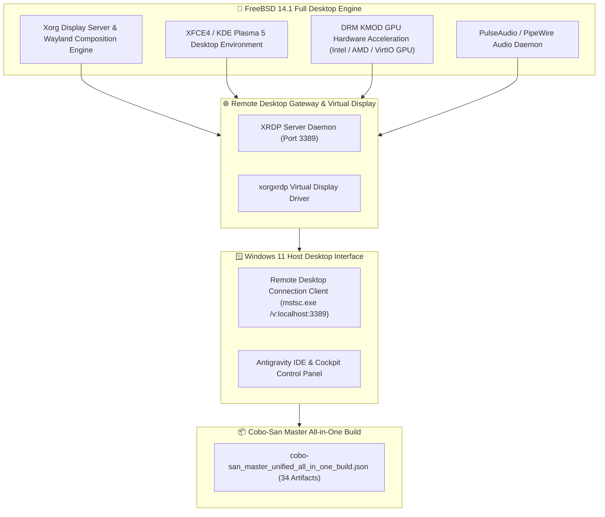

# 🎨 FreeBSD 14.1 Full Desktop GUI & XRDP Remote Desktop Blueprint

**Target VM Name:** `FreeBSD-Sandbox-CoboSan`  
**Desktop Environments Supported:** KDE Plasma 5/6, XFCE4 (Recommended), GNOME 40+  
**Remote Desktop Gateway:** XRDP (RDP Protocol @ Port 3389 for `mstsc.exe` connection)  
**Display Server & Audio:** Xorg / Wayland + DRM KMOD + PipeWire / PulseAudio  
**Financial Policy:** **`$0.00 FREE (100% Guaranteed)`**

---

## 🎨 1. Full Desktop GUI System Architecture



---

## ⚡ 2. Step-by-Step FreeBSD Full Desktop Setup Plan

### Step 1: Install Desktop Packages & Xorg Server
Run inside FreeBSD root shell:
```bash
# Update package repository and install Xorg, XFCE4, SDDM, XRDP, and Audio packages
pkg update && pkg install -y xorg xfce4 xfce4-goodies sddm xrdp xorgxrdp drm-kmod pulseaudio firefox
```

---

### Step 2: Configure System Daemons in `/etc/rc.conf`
Enable FreeBSD desktop services at boot:
```bash
sysrc dbus_enable="YES"
sysrc sddm_enable="YES"
sysrc xrdp_enable="YES"
sysrc xrdp_sesman_enable="YES"
sysrc kld_list+="i915kms" # Or amdgpu / virtio_gpu
```

---

### Step 3: Configure User Session & XRDP Startup
Configure default desktop startup session for user:
```bash
echo "exec startxfce4" > ~/.xinitrc
echo "exec startxfce4" > ~/.xsession
chmod +x ~/.xsession
```

---

### Step 4: Connect from Windows Host via Remote Desktop (`mstsc.exe`)
Double-click [launch_freebsd_desktop_rdp.bat](file:///C:/Users/Monica%20Fugazi/.antigravity-ide/living_repository/bin/launch_freebsd_desktop_rdp.bat) or run in Windows:
```cmd
mstsc.exe /v:localhost:3389
```

---

## 🚀 3. Generated Desktop Launchers & Setup Scripts

* **FreeBSD Automated Desktop Setup Script:**  
  [setup_freebsd_desktop_gui.sh](file:///C:/Users/Monica%20Fugazi/.antigravity-ide/living_repository/scripts/setup_freebsd_desktop_gui.sh)
* **1-Click Windows RDP Desktop Connector:**  
  [launch_freebsd_desktop_rdp.bat](file:///C:/Users/Monica%20Fugazi/.antigravity-ide/living_repository/bin/launch_freebsd_desktop_rdp.bat)
* **Single Cobo-San Build Package:**  
  [cobo-san_master_unified_all_in_one_build.json](file:///C:/Users/Monica%20Fugazi/.antigravity-ide/living_repository/cobo-san/cobo-san_master_unified_all_in_one_build.json)
