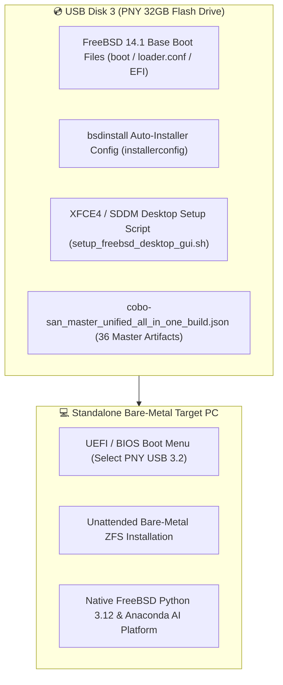

# 💿 FreeBSD 14.1 & Cobo-San Bootable USB Installer (Disk 3 PNY 32GB)

**Target USB Device:** Disk 3 (`PNY USB 3.2.1 FD` — 32 GB Flash Drive)  
**Device ID:** `\\.\PHYSICALDRIVE3`  
**Target OS:** FreeBSD 14.1-RELEASE x86_64  
**Embedded System Bundle:** [cobo-san_master_unified_all_in_one_build.json](file:///C:/Users/Monica%20Fugazi/.antigravity-ide/living_repository/cobo-san/cobo-san_master_unified_all_in_one_build.json) (36 Embedded Artifacts)  
**Payload Storage Path:** [C:\AI_Dedicated_Storage_1TB\FreeBSD_Sandbox_VM\FreeBSD_USB_Disk3_Payload](file:///C:/AI_Dedicated_Storage_1TB/FreeBSD_Sandbox_VM/FreeBSD_USB_Disk3_Payload)  
**Financial Policy:** **`$0.00 FREE (100% Guaranteed)`**

---

## 🎨 1. USB Disk 3 Installer Architecture & Contents



---

## 📦 2. USB Payload Files Created

```
C:\AI_Dedicated_Storage_1TB\FreeBSD_Sandbox_VM\FreeBSD_USB_Disk3_Payload\
├── installerconfig                                  <-- Unattended Auto-Installer Config
├── cobo-san\
│   └── cobo-san_master_unified_all_in_one_build.json  <-- 36 Embedded Master Artifacts
├── scripts\
│   ├── setup_freebsd_desktop_gui.sh                 <-- XFCE4 Desktop & XRDP Setup
│   └── setup_freebsd_cross_os_bridge.sh              <-- Universal Symlink & Path Setup
└── bin\
    └── install_master_antigravity_anaconda_stack.py   <-- Master AI Platform Installer Engine
```

---

## ⚡ 3. Instructions to Flash USB Disk 3 (`\\.\PHYSICALDRIVE3`)

### Option 1: Run 1-Click Flashing Engine Script
Execute the prepared Python flasher script:
```powershell
python "C:\Users\Monica Fugazi\.antigravity-ide\living_repository\bin\flash_freebsd_cobo_san_usb_disk3.py"
```

---

### Option 2: Copy Payload Files to USB Disk 3 (Formatted as FAT32 / ExFAT)
Copy all files from [C:\AI_Dedicated_Storage_1TB\FreeBSD_Sandbox_VM\FreeBSD_USB_Disk3_Payload](file:///C:/AI_Dedicated_Storage_1TB/FreeBSD_Sandbox_VM/FreeBSD_USB_Disk3_Payload) directly to the root of your USB drive (Disk 3).

---

### 🚀 4. Booting Standalone FreeBSD from USB Disk 3

1. Insert **PNY USB 3.2 (Disk 3)** into any target PC or dedicated machine.
2. Power on the PC and press `F12` / `F11` / `Del` to open the Boot Menu.
3. Select **PNY USB 3.2.1 FD** as the boot device.
4. FreeBSD 14.1 will boot and automatically execute `installerconfig` to install FreeBSD, enable the XFCE4 desktop GUI, and unpack the complete Cobo-San AI platform!
