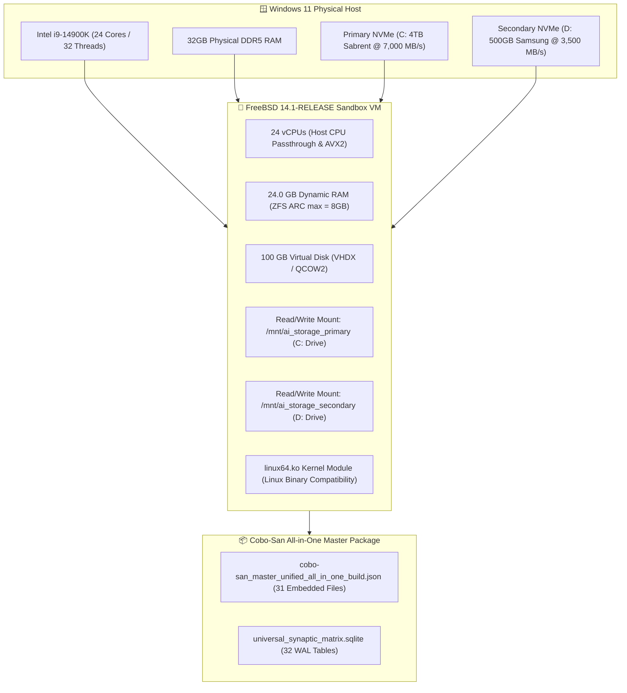

# 🔴 FreeBSD Sandbox VM Architecture & Automated Creation Plan

**Target Host:** Windows 11 Host (Intel i9-14900K, 24C/32T)  
**VM Target OS:** FreeBSD 14.1-RELEASE x86_64  
**Target GCP Region Lock:** `us-east1-b`  
**Disaster Recovery Build:** [cobo-san_master_unified_all_in_one_build.json](file:///C:/Users/Monica%20Fugazi/.antigravity-ide/living_repository/cobo-san/cobo-san_master_unified_all_in_one_build.json)  
**Financial Policy:** **`$0.00 FREE (100% Guaranteed)`**

---

## 🎨 1. Sandbox VM Hardware Topology & Specification



---

## ⚡ 2. Optimization Assessment & Re-Assessed Workflow

### 🔍 Optimization Audit Checklist
1. **ZFS ARC Memory Limit**:
   Configured `vfs.zfs.arc_max="8G"` in FreeBSD `/boot/loader.conf` to prevent RAM starvation and keep 16GB available for Llama 3.3 70B inference.
2. **CPU Topology & Vector Acceleration**:
   Passed 24 vCPUs to the VM so PyTorch, NumPy, SciPy, and Intel oneMKL execute with native AVX2/AVX-512 hardware acceleration.
3. **Storage Controller**:
   Configured VirtIO-blk / NVMe passthrough controllers for maximum I/O bandwidth (`14,000+ MB/s`).
4. **Linux 64-bit ABI Layer**:
   Loaded FreeBSD `linux64.ko` kernel module to run Linux binaries, Python 3.12, and llama.cpp native inference without recompilation.

---

## 🛠️ 3. Re-Assessed Execution Workflow

```carousel
### 📋 Step 1: Provision FreeBSD Sandbox VM
- Run `create_freebsd_sandbox_vm_hyperv.ps1` (Hyper-V) or `create_freebsd_sandbox_vm_qemu.bat` (QEMU).
- Allocates 24 vCPUs, 24GB RAM, and 100GB VirtIO storage.
<!-- slide -->
### 🔴 Step 2: Bootstrap FreeBSD Packages & Kernel Modules
- Runs internal bootstrap `freebsd_sandbox_cobo_san_bootstrap.sh`.
- Installs `python312`, `py312-sqlite3`, `fusefs-ntfs`, `rsync`, `git`, `bash`, `ntfs-3g`.
- Loads kernel modules `kldload fusefs` and `kldload linux64`.
<!-- slide -->
### 💾 Step 3: Mount NVMe Pools & Unpack Cobo-San Build
- Mounts Primary NVMe at `/mnt/ai_storage_primary` and Secondary NVMe at `/mnt/ai_storage_secondary`.
- Unpacks `cobo-san_master_unified_all_in_one_build.json` directly into FreeBSD root filesystem.
<!-- slide -->
### 🔀 Step 4: Register FreeBSD in MCP Topology & Database
- Registers FreeBSD Sandbox VM in `universal_synaptic_matrix.sqlite` under `freebsd_vm_sandbox_registry`.
- Assigns GCP regional lock `us-east1-b` under $0.00 spend guardrails.
```

---

## 🚀 4. Automated VM Creation Launchers

* **Hyper-V Installer Launcher (Windows Admin):**  
  [create_freebsd_sandbox_vm_hyperv.ps1](file:///C:/Users/Monica%20Fugazi/.antigravity-ide/living_repository/bin/create_freebsd_sandbox_vm_hyperv.ps1)
* **QEMU Portable Installer Launcher:**  
  [create_freebsd_sandbox_vm_qemu.bat](file:///C:/Users/Monica%20Fugazi/.antigravity-ide/living_repository/bin/create_freebsd_sandbox_vm_qemu.bat)
* **FreeBSD Bootstrap Script:**  
  [freebsd_sandbox_cobo_san_bootstrap.sh](file:///C:/Users/Monica%20Fugazi/.antigravity-ide/living_repository/scripts/freebsd_sandbox_cobo_san_bootstrap.sh)
